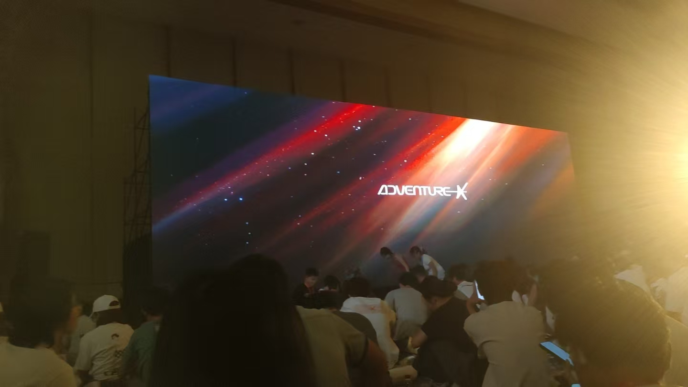
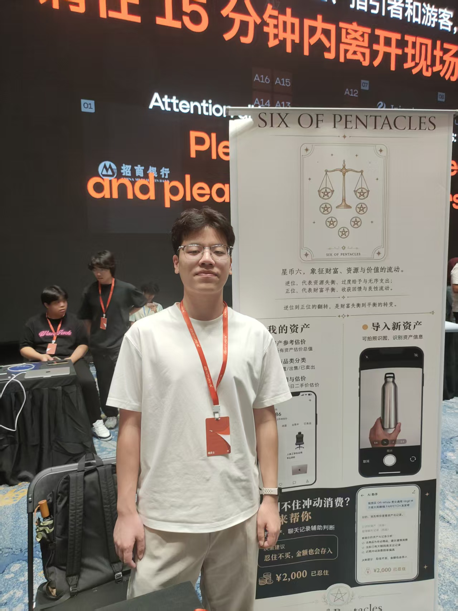
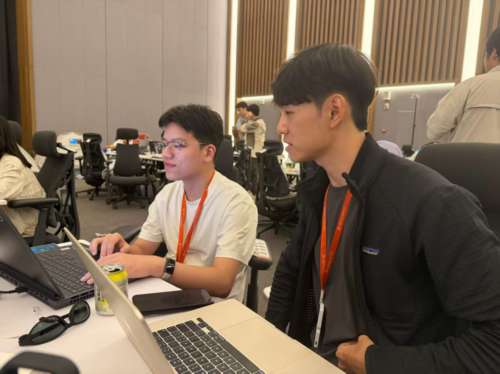

7 月 25 日凌晨两点，我们还在准备 Demo、部署和报名材料。

产品已经能够运行，但完成度不算高。报名信息还没有全部整理好，也没有录制演示视频，更没有准备断网后的备用方案。

当时没有特别强烈的情绪，只是觉得：这次获奖的概率可能不大了。

第二天，场馆网络不太稳定，原本准备好的在线功能无法正常演示。我们只能拿出手机，向观众展示之前跑通的页面和结果。

也是到了这时，我才意识到，Hackathon 并不是在几天内把代码写出来就结束了。

选题、组队、开发、提交和路演，其实是同一个过程。

## 我原本把自己放在 Builder 的位置
参加 AdventureX 之前，我主要想体验一次大型 Hackathon，看看大家怎样使用 AI，也认识一些新朋友。

我最担心的是组队。我的性格偏内向，不太擅长在现场快速介绍自己，也没有提前准备成熟的 Idea。对自己的定位，我想得比较简单：等团队确定产品方向，我负责把 AI 模块做出来。

当时我觉得，有 AI Coding 的帮助，几天内完成一个 MVP 应该不算太难。

真正开始后才发现，即使写代码变快了，工程框架、环境依赖、跨平台适配和部署仍然会消耗很多时间。更重要的是，AI Coding 可以帮助我们实现一个想法，却不能替我们判断应该做什么。

## 在时间压力下确定选题
组队后，我们讨论过几个方向。

创业大哥提出过智能耳机：在用户就医、约会或者商务沟通时，通过耳机提供实时提醒。这个方向很有想象力，但大家担心语音采集、模型处理和语音回复的整条链路延迟太高，最后没有继续。

现在回头看，放弃它未必是错的。问题在于，我们没有先花三十分钟做一个最小实验，而是主要根据感觉判断可行性。

后来，产品成员提出了闲置物品管理。我们在此基础上加入心愿单、克制消费和 AI 购物建议，逐渐形成了“星币六”。

它希望帮助用户了解自己已经拥有什么，在购买新物品前重新判断需求，也可以通过出售闲置物品推进自己的心愿。

这个方向有真实需求，开发范围也相对可控。但确定得比较仓促。我们没有系统比较需求强度、创新性、可演示性、团队匹配和赛道契合，更多是几个人觉得可以做，于是就开始做了。

我后来还提出加入 Web3，让闲置物品进一步流转和交易。但当时没有时间回答一个关键问题：这件事为什么一定需要上链？最后它只停留在设想里。

## 能力互补，不等于方向匹配
方向确定后，创业大哥觉得自己在这个项目中难以发挥，因此没有继续参与开发。

我们之间没有因此产生矛盾。路演前，他还回来和我们一起讨论，并提出了从年轻人的冲动消费延伸到不同人生阶段财商管理的故事。

这个故事增强了路演的吸引力，但也比当前 Demo 能支撑的范围更大。我们真正做出来的，还是闲置物品、心愿单和 AI 消费决策。

这让我意识到，组队不能只看成员的能力是否互补，还要看选题能否让每个人真正参与进来。团队配置看起来完整，不代表方向一定匹配。

## 功能做出来了，但体验不够鲜明
开发过程中，前端队友负责 Expo App 和大部分功能，产品成员负责产品设计、视觉和报名材料，我主要负责 AI 决策模块，也参与了后期部署与演示。

由于前端队友使用 iOS，而我使用 Windows，Expo 的环境和启动适配消耗了大约两个小时。平时两小时不算长，但在 Hackathon 里，已经会明显挤压后面的调试时间。

我们最终完成了闲置物品录入、心愿单和 AI 消费建议。AI 会读取用户已有的物品与心愿，输出“建议结论、理由和行动方案”。

所以，AI 确实进入了产品的核心链路。但从观众视角看，它仍然很容易被理解成：

AI 读取了我的信息，然后告诉我应不应该买。

问题不是没有 AI，而是 AI 的作用没有转化成足够直观的产品体验。

更完整的链路应该是：用户录入一件闲置物品，准备购买心愿单中的新物品；AI 结合已有资产和预算，给出“暂缓购买”或者“先卖后买”的建议；闲置物品出售后，获得的资金再进入心愿进度。

这样观众看到的就不只是一次对话，而是一次真实发生变化的消费决策。

遗憾的是，我们没有在开发前先确定这条 Demo Story。功能逐渐增加，但如何用一个具体场景把它们串起来，是到后期才开始考虑的。

## 凌晨两点以后
最后一晚，我们仍在处理部署、演示和报名信息。材料集中由一人负责，也没有安排另一个人逐项复核赛道要求。

第二天网络出现问题时，前面的准备不足被一起放大了。

现场有人问，为什么不用闲鱼或者记账软件；也有人认为，如果需求成立，很容易被大公司复制。这些问题都指向同一点：我们还没有完全讲清楚“星币六”为什么应该成为一个独立产品。

也有人对产品感兴趣，我们临时建立了一个十人左右的内测群。但活动结束后，大家回到原本的生活节奏，群里也逐渐安静下来。它只能说明现场存在兴趣，还不能证明长期需求。

最终没有获奖时，我还是有些难过。不过比起反复猜测评委的想法，我更想把自己能够看见的问题整理清楚。

我认为主要有三个：

第一，选题判断、产品差异化和团队匹配不足。我们没有统一的评估方法，也没有完全想清楚与闲鱼、记账软件的区别。

第二，Demo 和路演准备不足。没有提前确定完整的演示故事，也没有准备离线视频和弱网方案。

第三，报名材料缺少复核。最后一晚还在集中填写，没有安排第二个人对照赛道要求逐项检查。

它们其实是一条连续的链路：选题依据不够清楚，产品主线就容易模糊；主线模糊，功能优先级和 Demo Story 就难以确定；到了最后，只能同时补功能、部署、材料和路演。

## 下一次会有什么不同
下一次参加 Hackathon，我会先准备一份简短的个人介绍，把自己能够快速提供的能力拆成几个原子模块，例如 AI 结构化输出、上下文读取、简单的 Agent 工作流和后端接口。

选题时，团队需要从需求强度、创新性、可演示性、团队匹配、商业空间和赛道契合几个方面进行比较。对于存在争议的方向，先做三十到六十分钟的最小实验。

正式开发前，先写出一条完整的 Demo Story，再反推必须完成的功能。提交前安排一人独立复核材料，路演前准备离线视频，以及三十秒、两分钟和五分钟三个版本的介绍。

这些流程并不复杂，但能避免最后一晚同时补所有东西。

## 我想成为怎样的 Builder
这次经历并没有改变我当前的定位。我还是希望以 AI 应用开发为主，先做好一个 Builder。

但我也不想把 Builder 理解成等待需求、完成开发的人。

一个好的 Builder 需要参与问题判断，验证想法，理解用户，也要知道哪些功能应该放弃。代码跑通只是完成了一部分，产品最终能否被理解、被使用，同样需要负责。

我也希望自己不只是工程能力更强。以后无论是尝试轻创业，还是逐渐参与更多产品工作，都需要创意、产品判断和对真实需求的理解。

这次 Hackathon 让我第一次比较完整地看到，一个想法如何被提出、被选择、被实现，又如何在展示时暴露出前面没有解决的问题。

凌晨两点以后，我开始理解 Hackathon，也开始重新理解自己想成为怎样的 Builder。
