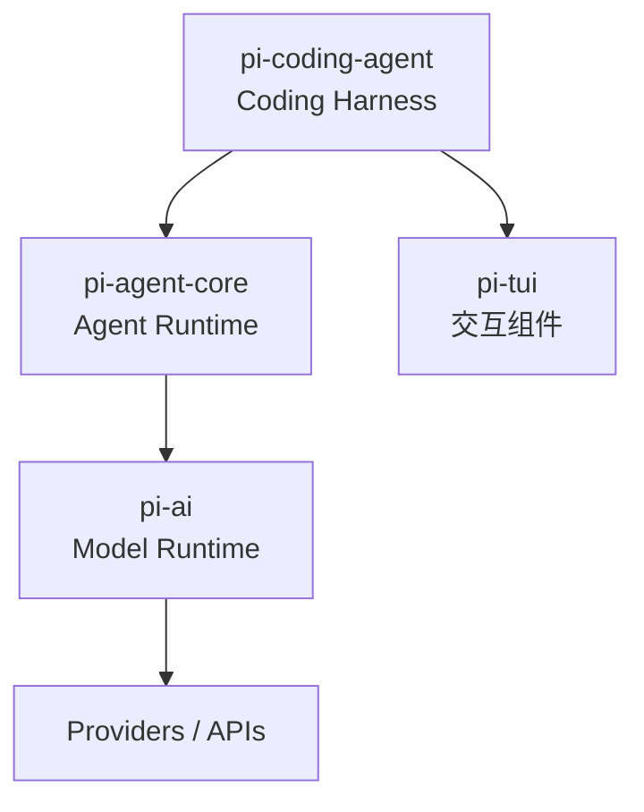
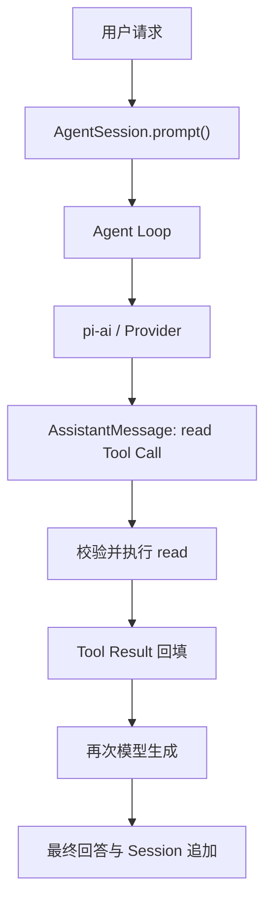
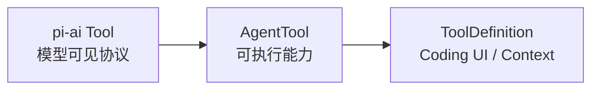
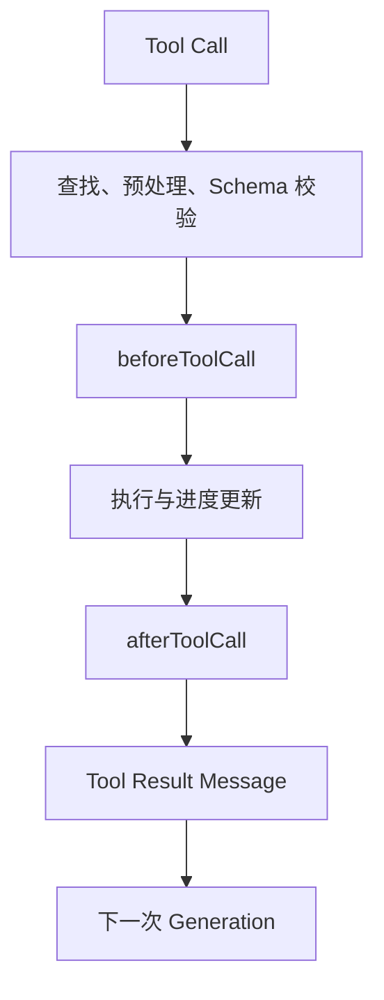
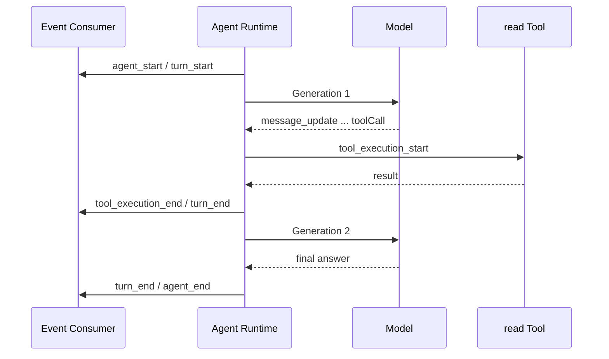
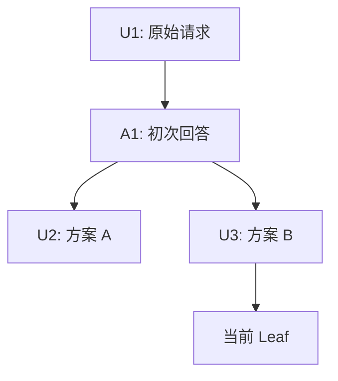
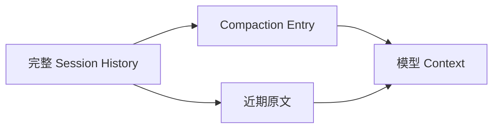
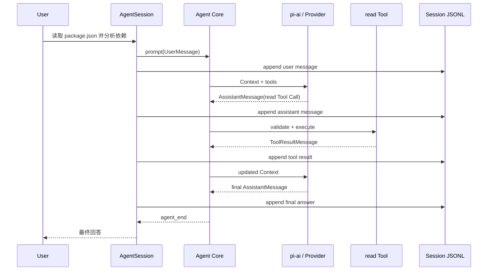

> - 源码仓库：[earendil-works/pi](https://github.com/earendil-works/pi)
> - 分析版本：[aa0ec808b970db31822e07835a46647cb51d9d66](https://github.com/earendil-works/pi/tree/aa0ec808b970db31822e07835a46647cb51d9d66)
> - Commit 时间：2026-08-01
> - 对应包版本：`0.83.0`

Pi 既是一个可以直接使用的终端 Coding Agent，也是一套分层复用的 Agent 工程实现。本文不按仓库目录逐文件介绍，而是追踪一个请求：

> 读取 `package.json`，告诉我项目使用了哪些关键依赖。
>

这条请求会经过运行环境组装、模型流式生成、`read` Tool Call、参数校验、文件读取、Tool Result 回填、第二次模型生成和 Session 持久化。沿着这条链路，可以把模型适配、Agent Loop、工具系统、上下文、事件流和会话存储放进同一张地图，而不是分别背诵概念。

本文中的 `pi-agent-core` 指 npm 包 `@earendil-works/pi-agent-core`，源码位于 `packages/agent`。早期资料中的 `badlogic/pi-mono`、`@mariozechner/*` 等名称已经迁移，本文只以锁定 Commit 的实现为准。

---

# 第一部分：阅读源码前，先锁定 15 个问题
这 15 个问题既是源码阅读入口，也是后文的覆盖检查。先知道自己要解释什么，再进入类型与函数，能避免把“看过代码”误当成“理解设计”。

**Q1：Pi 的三层主干分别解决什么问题，`pi-tui` 为什么不属于主链路？**
需要区分 `pi-ai` 的模型调用、`pi-agent-core` 的 Agent Runtime、`pi-coding-agent` 的 Coding Harness，以及作为事件消费者和交互组件库存在的 `pi-tui`。

**Q2：为什么依赖方向是 Coding Agent → Agent Core → AI？**
需要回答各层可否独立使用、上层为什么能使用底层类型，以及把 Provider、Loop、Session 分开后，具体移除了哪些耦合。

**Q3：`pi-ai` 如何把不同 Provider 和 API 组织成统一模型能力？**
需要理解 `Provider`、`Model`、API 实现、认证和模型发现的关系，而不是笼统地说“封装了多模型”。

**Q4：为什么一次模型调用不是“请求进去，字符串出来”？**
需要覆盖流式事件、text、thinking、tool call、最终 `AssistantMessage`、`stopReason`、usage、cost、Error、Abort 和部分输出。

**Q5：会话中途切换模型或 Provider，原有上下文怎样继续使用？**
需要检查消息格式转换、Thinking 签名、Tool Call ID、图像能力差异和转换的有损边界。

**Q6：Agent Loop 如何启动、继续和停止？**
需要严格区分一次模型 Generation、一次 Turn 和一次完整 Agent Run，并说明 `prompt()`、`continue()`、Tool Result、错误和用户中止怎样改变流程。

**Q7：Agent 内部消息为什么不能直接作为模型 Context？**
需要理解 `AgentMessage`、模型 `Message`、`transformContext()` 和 `convertToLlm()` 的边界。

**Q8：一次 Tool Call 从模型输出到结果回填，要经过哪些阶段？**
需要追踪工具识别、参数预处理、Schema 校验、Hook、执行、进度更新、结果转换、错误回填和 `toolCallId` 关联。

**Q9：多个工具如何调度，失败和 Abort 分别意味着什么？**
需要区分顺序与并行、准备顺序与完成顺序、结果回填顺序，以及已经完成、正在执行和尚未开始的工具在中止时会发生什么。

**Q10：为什么 Pi 同时需要事件流、steering 和 follow-up？**
需要说明 Agent、Turn、Message、Tool 四层事件如何解耦 Runtime 与 UI，以及两类队列为什么有不同消费时机。

**Q11：`pi-coding-agent` 如何把通用 Runtime 组装成可用的 Coding Agent？**
需要找到 Model、认证、System Prompt、项目指令、Skills、工具、Extensions、`AgentSession` 和事件消费者的汇合点。

**Q12：Pi 如何决定哪些信息进入模型 Context？**
需要覆盖 System Prompt、`AGENTS.md`、Skills 渐进加载、工具输出截断、扩展动态改写、Session 压缩和模型格式转换。

**Q13：为什么 Session 使用 append-only JSONL 树，而不是普通聊天数组？**
需要解释 Entry、`id/parentId`、当前 Leaf、模型切换节点、分支导航、恢复和原始历史保留。

**Q14：Compaction 压缩了什么，又没有改变什么？**
需要解释触发阈值、Token 预算、切割点、Tool Call 边界、结构化摘要、近期消息、多次压缩，以及它与 Branch Summary 的区别。

**Q15：为什么 Pi 把很多能力留给扩展，而不直接内置？**
需要区分 Extension、Skill、Prompt Template、Pi Package 和运行模式，同时正视极简内核的收益、组合成本与安全边界。

---

# 第二部分：沿一次请求拆解 Pi
## 第 1 章：Pi Agent 到底是什么
### 1.1 从 Coding Agent 到 Agent Harness
从使用者视角看，Pi 是一个能读取文件、执行命令、编辑代码并保存会话的终端 Coding Agent。从源码视角看，它更像一组可组合的基础构件：底层统一模型调用，中层负责 Agent 的运行语义，上层再补齐编码场景所需的工具、上下文、会话和交互。

“极简”并不表示实现只有一个 `while` 循环。一个真正可用的 Agent 至少要处理流式输出、工具调用、错误语义、用户中止、运行中插话、上下文投影和状态恢复。Pi 的“最小”是把这些通用机制放进内核，同时拒绝替所有使用者预设完整工作流。

因此，Pi 的核心取向可以概括为：提供原子化能力，尽量少规定 features。它默认没有 MCP、子 Agent、Plan Mode、权限弹出窗口、Todo System 和 Background Bash，但允许使用 Extension、Skill 或外部环境组合这些能力。这不是“做不到”，而是明确把工作流策略留在内核之外。

### 1.2 为什么沿一次请求阅读
按目录阅读容易得到一堆互不相连的认识：`types.ts` 定义了消息，`agent-loop.ts` 有循环，`session-manager.ts` 写 JSONL。沿一次请求阅读则会持续追问三个问题：请求现在走到哪里，Pi 在这一层做了什么，为什么由这一层负责。

本文不讨论通用 ReAct 历史，也不把业务系统中的权限、幂等、审核和 Eval 强行映射进 Pi。Pi 提供的是模型适配、Agent Runtime 和 Coding Harness；上层业务的成功标准、数据可信度与操作授权仍要由具体应用负责。

---

## 第 2 章：三层架构与一次请求的总路线
### 2.1 三层主干与一个正交 UI 层


`pi-ai` 负责模型、Provider、认证、请求翻译和流式响应归一化。它能产生包含文本、思考和 Tool Call 的 `AssistantMessage`，但不会执行工具。

`pi-agent-core` 在其上组织 Agent Run。它持有消息、工具和运行状态，把 `AgentMessage[]` 投影成模型可理解的 `Message[]`，调用 `pi-ai`，执行 Tool Call，再把 Tool Result 放回下一次模型调用。

`pi-coding-agent` 把通用 Runtime 组装成编码产品。它选择模型与认证，构造 System Prompt，加载项目指令、Skills、Prompt Templates 和 Extensions，注册 `read/bash/edit/write` 等工具，并通过 `AgentSession` 管理持久化、压缩、重试和运行中交互。

`pi-tui` 不决定 Agent 下一步做什么。它消费事件、显示增量文本与工具状态、收集用户输入。Runtime 不直接依赖某个终端界面，因此相同内核也能服务 Interactive、Print/JSON、RPC 和 SDK。

### 2.2 为什么依赖只能向下
依赖方向表达的是知识边界。`pi-ai` 不需要知道文件系统、Session 或 Coding Agent；`pi-agent-core` 只依赖统一模型协议，不关心 `read` 的具体实现；`pi-coding-agent` 则可以同时使用下层类型，完成场景化组装。

这使复用深度变得明确：只需要多模型调用时使用 `pi-ai`；需要通用 Agent Loop 时再引入 `pi-agent-core`；需要完整编码 Harness 时才使用 `pi-coding-agent`。如果反向依赖，底层模型库就会被 CLI、文件工具和 Session 规则绑住，无法作为独立能力复用。

上层直接使用底层类型并不破坏分层。例如 Coding Agent 的 `convertToLlm()` 返回 `pi-ai` 的 `Message[]`，自定义工具最终满足 `AgentTool`。分层要求的是底层不知道上层，而不是禁止上层复用底层协议。

### 2.3 一次请求怎样穿过三层


用户输入先到 `AgentSession.prompt()`。Prompt Template、Skill 命令和 Extension 命令等上层逻辑在这里处理，随后标准用户消息交给 `Agent.prompt()`。Agent Loop 构造模型 Context，调用 `pi-ai`。模型第一次生成 `read({path:"package.json"})`；Runtime 校验并执行工具，把结果封装为 `ToolResultMessage`；因为上一轮包含 Tool Call，Loop 再发起一次模型生成，最终得到自然语言答案。与此同时，`AgentSession` 监听消息结束事件，将用户消息、AssistantMessage 和 Tool Result 依次追加到 Session Tree。

### 2.4 四类状态不要混为一谈
| 状态 | 持有者 | 作用 |
| --- | --- | --- |
| Provider、Model、认证与运行配置 | `pi-ai` / Coding Agent 配置 | 决定请求发给谁、怎样认证和调用 |
| Agent Messages 与执行状态 | `pi-agent-core.Agent` | 表达当前 transcript、流式消息和运行中工具 |
| 本次模型 Context | 每次调用前临时构造 | 只包含当前模型此刻应该看见的内容 |
| Session Tree | `pi-coding-agent.SessionManager` | 保存可恢复、可分支的历史事实 |
| UI 展示状态 | TUI 或其他事件消费者 | 呈现流式文本、工具进度和队列状态 |


同一条消息可能先成为 Session Entry，恢复时投影为 AgentMessage，再在某次调用前转换为模型 Message。三者相关，却不是同一个对象。

---

## 第 3 章：`pi-ai` 如何完成一次真实模型调用
### 3.1 从统一请求到 Provider 请求
Agent Runtime 调用模型时，交给 `pi-ai` 的核心输入是 `Model`、`Context` 和流式选项。`Context` 只包含 `systemPrompt`、`messages` 和 `tools`；`Model` 则描述 provider、api、模型 ID、上下文窗口、最大输出、输入模态、推理能力与成本。

这里要区分 Provider 和 API。Provider 是具体运行单元，拥有标识、认证方式、模型列表和流式入口；API 实现负责把统一 Context 翻译成 Anthropic Messages、OpenAI Responses、Google Generative AI 等协议。一个 Provider 可以按模型的 `model.api` 分派到不同 API 实现。`Models` 集合负责找到模型所属 Provider、解析认证并委托调用，而不是自己实现所有厂商协议。

{/* 这是一个文本绘图，源码为：flowchart LR
    CTX["Model + Context"] --> MS["Models.streamSimple"]
    MS --> PR["Provider"]
    PR --> API["API translator"]
    API --> UP["Upstream model"] --> */}


认证在每次请求前解析，而不是在会话启动时永久冻结。这对会过期的 OAuth Token 很重要：长时间工具执行后，下一次 Generation 可以重新取得有效凭证。Coding Agent 还在这一层补充超时、重试、归因 Header 和 Provider 请求扩展 Hook。

### 3.2 模型输出为什么不是字符串
上游返回的是一个过程。Pi 将不同厂商的流式协议统一为 `AssistantMessageEventStream`：先发出 `start`，随后可能交错出现 `text_*`、`thinking_*` 和 `toolcall_*`，最后以 `done` 或 `error` 收束。

这些增量不断更新同一个 partial `AssistantMessage`。最终消息包含内容块、实际 Provider/API/Model、usage、cost、`stopReason`、时间戳，以及错误时的 `errorMessage`。`stopReason` 可能是 `stop`、`length`、`toolUse`、`error` 或 `aborted`；流式阶段使用的 `pending` 不应作为最终 Session 消息保存。

以示例为例，第一次模型响应可能先产生少量 thinking，再逐步生成 `read` 的工具名与 JSON 参数，最终以 `toolUse` 结束。此时“一次模型生成”已经完整结束，但 Agent 还没有回答用户。Tool Call 只是结构化内容块，是否执行由上一层决定。

Pi 的 `EventStream` 同时支持异步迭代和 `result()`：前者让 UI 实时消费事件，后者让 Runtime 获得聚合后的最终 `AssistantMessage`。因此流式展示和最终状态不是两套互相独立的实现。

### 3.3 Error、Abort 与部分输出
模型请求失败不应只表现为一个脱离上下文的 Promise rejection。`pi-ai` 的流式契约要求请求、模型或运行时失败通过 `error` 事件和最终 `AssistantMessage` 表达，`stopReason` 为 `error` 或 `aborted`。这样 Runtime、Session 和 UI 都能观察到同一种结束语义。

错误前已经产生的部分文本仍可存在于 partial message 中，但 Coding Agent 在跨请求重放历史时会跳过 `error` 和 `aborted` 的 AssistantMessage，因为它们可能包含不完整推理或残缺 Tool Call。保留错误事实用于展示和审计，不等于把残缺内容继续发给下一模型。

### 3.4 切换模型时，统一抽象的边界
会话切换 Provider 后，旧消息不会原样塞入新协议。`transformMessages()` 会根据目标模型处理跨模型差异：不支持图像时用占位文本替换图片；跨模型时把可读 thinking 降级为普通文本，丢弃只对原模型有效的 redacted thinking；移除 Provider 专属的 thought signature；必要时归一化 Tool Call ID，并同步更新 Tool Result 的关联 ID。

它还会为孤立 Tool Call 补合成错误结果，避免新 Provider 收到不完整工具对。错误或中止的 AssistantMessage 则不参与重放。

这说明统一接口解决的是“共同协议和调用方式”，不是让所有模型完全等价。加密推理签名、Prompt Cache、上下文窗口、工具约束采样和图像能力仍然具有 Provider 语义。跨模型会话可以继续，但转换必然可能有损。

本章对应的主要源码是：

`packages/ai/src/types.ts`、`packages/ai/src/models.ts`、`packages/ai/src/utils/event-stream.ts`、`packages/ai/src/api/transform-messages.ts`，以及 `packages/ai/src/api/*` 下的具体协议实现。

---

## 第 4 章：Agent Loop 如何组织多次模型生成
### 4.1 Prompt 如何启动一次运行
`Agent` 是有状态的 Runtime 包装。它保存 System Prompt、当前 Model、Thinking Level、工具集合、完整 Agent Messages，以及 `isStreaming`、partial message、pending tool calls 和最近错误等运行状态。

调用 `prompt()` 时，字符串先被标准化为 `UserMessage`。如果 Agent 已在运行，新的 `prompt()` 会被拒绝，调用方必须等待结束，或明确使用 steering / follow-up 入队。随后 `runAgentLoop()` 发出 `agent_start`、`turn_start` 和用户消息事件，再开始第一次模型 Generation。

`continue()` 不会自动添加新用户消息，而是从现有 transcript 的最后一条 user 或 tool result 继续，适合重试或 Session 恢复后的续跑。如果最后一条是 assistant，只有队列里已有 steering / follow-up 时才会用它们开启新运行，否则会拒绝继续。这一限制保证 Provider 不会收到语义不完整的上下文尾部。

### 4.2 Generation、Turn 与 Run
| 概念 | 起止范围 | 示例中的数量 |
| --- | --- | --- |
| Generation | 一次 Provider 请求到一个最终 `AssistantMessage` | 两次：提出 `read`，再生成答案 |
| Turn | 一个 AssistantMessage 加上它触发的整批 Tool Results | 两次 |
| Agent Run | 从一次 `prompt/continue` 到 `agent_end` | 一次 |


Pi 的 Turn 不是传统聊天中“用户一句＋助手一句”的宽泛说法。在源码事件语义里，一个 Turn 以 assistant 生成和其工具批次为中心。Tool Result 会推动下一个 Turn；没有 Tool Call、steering 和 follow-up 时，整个 Run 才结束。

### 4.3 AgentMessage 如何投影成模型 Context
每次 Provider 调用前，Loop 都执行同一条边界转换：

{/* 这是一个文本绘图，源码为：flowchart LR
    AM["AgentMessage[]"] --> TC["transformContext()"]
    TC --> CL["convertToLlm()"]
    CL --> MM["Message[]"]
    MM --> CX["Context"] --> */}


`AgentMessage` 比模型 `Message` 更丰富。Coding Agent 还需要保存直接 Bash 执行、Extension 自定义消息、Branch Summary 和 Compaction Summary。它们有 UI 或恢复语义，却不能全部按原类型发送给 Provider。

`transformContext()` 工作在 AgentMessage 层，适合让 Extension 动态注入、删除或修改上下文。`convertToLlm()` 才完成模型协议投影：普通 user/assistant/toolResult 直接保留；可见 Bash 记录、Custom Message 和两类 Summary 转成 user message；标记为排除上下文的 Bash 记录被过滤。若设置禁止图片，还会把图片替换为说明文本。

因此，Agent State 是运行事实，Model Context 是一次性的视图。先保留丰富语义，再在调用边界转换，能够同时服务 Session、UI、扩展和不同 Provider；代价是多了一条必须理解和测试的转换链。

### 4.4 Loop 为什么继续，又为什么停止
第一次 Generation 得到 `read` Tool Call 后，AssistantMessage 先写入状态。Loop 找出所有 Tool Call，执行并追加 Tool Results，然后发出 `turn_end`。因为存在工具结果，内层循环继续，下一次 Generation 能看到“模型提出了什么调用”以及“工具实际返回了什么”。

第二次 Generation 没有 Tool Call。Loop 在当前 Turn 结束后检查 steering；没有则离开内层循环，再检查 follow-up；仍没有才发出 `agent_end`。

如果 AssistantMessage 以 `error` 或 `aborted` 结束，当前 Turn 和 Run 会直接收束。若输出因 token 上限以 `length` 结束且其中出现 Tool Call，Pi 不会冒险执行可能被截断的参数，而是为整批调用生成错误 Tool Result，要求模型重新发出完整调用。

Loop 还允许 `prepareNextTurn` 在 Turn 之间替换下一轮 Context、Model 或 Thinking Level，也允许 `shouldStopAfterTurn` 做优雅停止。它不是“固定循环 N 次”，而是由模型输出、工具结果、队列和 Runtime 状态共同决定下一步。

本章对应 `packages/agent/src/agent.ts`、`packages/agent/src/agent-loop.ts`、`packages/agent/src/types.ts`，Coding Agent 的消息转换位于 `packages/coding-agent/src/core/messages.ts`。

---

## 第 5 章：一次 Tool Call 如何真正变成工具结果
### 5.1 Tool Call 只是执行请求
模型生成的 `ToolCall` 只有 ID、名称和参数。Runtime 收到它后先在当前工具集合中按名称查找 `AgentTool`。找不到工具、参数不符合 Schema、参数预处理失败或 `beforeToolCall` 明确阻断时，都不会执行真实动作，而是生成 `isError: true` 的 Tool Result。

三层中的工具类型逐步增加职责。`pi-ai.Tool` 只定义给模型看的名称、描述和参数 Schema；`pi-agent-core.AgentTool` 增加 label、`execute()`、进度回调和执行模式；Coding Agent 的 `ToolDefinition` 再补充 Prompt 片段、运行上下文与 TUI 渲染能力，最后通过 wrapper 适配为 AgentTool。



把“模型提出调用”和“系统执行动作”分开，才有位置实施 Schema 校验、权限检查、参数兼容和审计。如果两者等同，模型输出一段 JSON 就会直接成为副作用，Runtime 无法建立可靠边界。

### 5.2 `read` 如何执行
示例中的 `read` 参数先经过 TypeBox Schema 校验。随后工具解析相对或绝对路径，检查可读性，识别文本或图片，再执行实际读取。文本输出默认最多保留 2000 行或 50 KB，按先触达的限制截断，并在 details 中保留截断元数据；模型可根据提示继续使用 offset / limit 读取后续内容。

这说明工具输出截断不是 UI 的省略显示，而是 Context 管理的一部分。若把任意大文件完整塞回模型，一次读取就可能耗尽上下文。工具既要完成外部动作，也要把结果整理成适合再次推理的形态。

工具执行时会获得 `AbortSignal` 和 `onUpdate`。长任务可以报告 `tool_execution_update`，也应主动响应中止。工具抛出的异常会被 Runtime 捕获并转换为错误 Tool Result，而不是让整个 Agent 立即丢失上下文。`afterToolCall` 还可以在结果进入消息流前替换 content、details、usage、error 标志或终止提示。

### 5.3 Tool Result 怎样回到 Loop
执行完成后，Runtime 用原始 `toolCall.id` 构造 `ToolResultMessage.toolCallId`，同时记录工具名、内容、details、usage 和 `isError`。这个 ID 是模型提出的请求与外部执行结果之间的关联键。只在终端打印文件内容并不够；结果必须作为消息重新进入 transcript，下一次模型生成才能依据真实数据完成回答。

完整工具管道是：



失败也进入同一管道。未知工具、非法参数、Hook 阻断和执行异常的来源不同，但都会形成模型可读的错误结果。这样模型仍可修正参数、换用其他工具或向用户说明阻塞。

### 5.4 多工具的顺序、并行和 Abort
默认工具策略是 parallel，但准备阶段仍按模型声明顺序进行；如果全局设置为 sequential，或本批任一工具声明 `executionMode: "sequential"`，整批按顺序执行。

并行模式下，允许执行的工具并发运行，`tool_execution_end` 按实际完成时间出现；全部结束后，Tool Result 消息仍按 AssistantMessage 中 Tool Call 的原始顺序回填。这样 UI 能及时显示谁先完成，模型上下文却保持稳定、可复现的顺序。

AbortSignal 会传到 Hook 和工具。顺序模式在发现中止后不再启动后续调用；并行模式中已经启动的工具需要自行响应 Signal，尚未准备的调用不会继续启动。已经完成的结果仍可保留。中止不是数据库事务回滚，Runtime 无法自动撤销外部世界中已经发生的副作用。

一个批次只有在每个最终 Tool Result 都设置 `terminate: true` 时，才不会由本批工具继续触发下一次模型生成；如果另有 steering 或 follow-up，Run 仍可继续。单个工具无权在同批其他工具仍需处理时擅自终止整个 Run。

本章主要对应 `packages/agent/src/agent-loop.ts`、`packages/agent/src/types.ts`、`packages/coding-agent/src/core/tools/*` 和 `packages/coding-agent/src/core/tools/tool-definition-wrapper.ts`。

---

## 第 6 章：事件流如何让运行过程可观察、可干预
### 6.1 四层生命周期事件
Agent Runtime 不直接调用终端 UI，而是输出事件。一次示例请求大致产生以下顺序：



Agent 事件表示整次 Run，Turn 事件圈住一次 AssistantMessage 及其工具批次，Message 事件表达用户、assistant 和 tool result 的开始、更新与结束，Tool 事件表达外部执行生命周期。UI、JSON 输出、RPC 适配器和 SDK 调用方可以消费同一套事实，只选择不同呈现方式。

### 6.2 为什么监听器会影响运行时序
`Agent.subscribe()` 的监听器按订阅顺序执行，返回的 Promise 会被等待。即使已经发出 `agent_end`，Agent 也要等对应监听器完成后才真正进入 idle。这保证 Session 持久化、扩展处理和 UI 状态不会落后于“任务已经结束”的信号。

代价是监听器不再只是旁路日志。缓慢监听器会增加延迟，抛错也可能影响运行。Pi 选择了强顺序与一致性，而不是把所有观察者都做成不可控的 fire-and-forget。工具的高频 update 由执行函数收集对应 Promise，并在工具结束前统一等待，避免工具已经宣布完成但进度事件仍在漂移。

只返回最终答案无法支撑 Coding Agent：用户看不到模型是否仍在思考、正在读取哪个文件、某个命令是否卡住，也无法在运行中插入新意图。事件流把“执行过程”提升为公共输出。

### 6.3 steering 与 follow-up 为什么不能合并
steering 用于改变正在进行的 Run。消息入队后，要等当前 Assistant Turn 及其整批工具执行完成，再在下一次模型调用前注入。当前 Commit 不会因为 steering 跳过本批剩余 Tool Call；它改变的是后续推理，而不是撤销已经形成的当前工具计划。

follow-up 则等 Agent 原本将要停止时才消费。例如当前问题完全回答后，再处理“顺便看看这些依赖是否过期”。它不会打断现有任务的收束。

两种队列都支持 `all` 与 `one-at-a-time`。前者在消费点一次注入全部消息，后者每次只取最早一条。这不仅影响 UI 顺序，也影响模型看到的是一组同时约束，还是逐条形成新的 Turn。

假设工具执行期间用户输入“也检查 scripts”：作为 steering，它会在本次 `read` 结束后进入下一轮 Context，模型可据此继续读取；如果作为 follow-up，则要等原有依赖分析完成后才开始。相同文本因为消费时机不同，具有不同控制语义。

到这里，Runtime 主链路已经闭环：用户消息触发 Generation，Tool Call 经过真实执行成为 Tool Result，结果推动下一次 Generation，事件流对外公开过程，队列允许用户在合适边界改变后续运行。

---

## 第 7 章：Coding Agent 如何组装一次运行
### 7.1 不同入口如何汇合到 `AgentSession`
Interactive、Print/JSON、RPC 和 SDK 的输入输出方式不同，但都复用 `AgentSession` 与底层 Agent。Interactive 使用 TUI 收集输入并呈现组件；Print/JSON 适合一次性命令和事件管道；RPC 通过 stdin/stdout 的 JSONL 让非 Node 程序控制会话；SDK 直接暴露 `createAgentSession()` 和对象 API。

这四种模式不是四套 Agent Loop。它们共享 Model Runtime、工具、Session 和事件，只在谁提供输入、谁消费事件、怎样返回结果上分叉。

### 7.2 请求执行前，运行环境怎样形成
`createAgentSession()` 是关键组装入口。它确定 cwd、Agent 配置目录、`ModelRuntime`、`SettingsManager`、`SessionManager` 和 `ResourceLoader`。若继续已有 Session，会从当前分支恢复模型、Thinking Level 和 Agent Messages；否则按显式参数、设置与 Provider 默认值选择初始模型。

随后它创建 `Agent`，注入 Coding Agent 的 `convertToLlm()`、模型流式函数、动态认证、Provider 请求 Hook、Context 扩展 Hook、队列模式和传输设置。默认激活 `read`、`bash`、`edit`、`write` 四个工具，也允许 SDK 调用方选择、排除或加入自定义工具。

真正的 System Prompt 在 `AgentSession` 初始化资源后构造。默认内容保持简短：身份、当前可用工具、少量行为规则、Pi 文档位置和工作目录。`AGENTS.md`、`CLAUDE.md` 等项目上下文会作为 `<project_context>` 附加；`.pi/SYSTEM.md` 可替换默认 Prompt，`.pi/APPEND_SYSTEM.md` 用于追加。Skills 只把名称、描述和文件位置加入 System Prompt，完整 `SKILL.md` 等到匹配任务时再通过 `read` 加载。

因此，模型启动前看到的不是“所有项目资料”，而是一组分层供给：稳定规则放 System Prompt，项目约束放上下文文件，能力目录只放 Skill 元数据，大体积内容由工具按需读取。

### 7.3 Prompt Template、Skill 与 Extension 的进入位置
Prompt Template 在 `AgentSession.prompt()` 前展开，把 `/review` 一类短命令转为完整用户 Prompt；它不改变 Runtime，也不执行代码。

Skill 是供模型按需读取的能力说明，可同时携带脚本、参考资料和资产。Pi 启动时扫描并验证元数据，模型真正需要时才读取全文。这是渐进式披露，而不是把每个 Skill 永久塞进 Context。

Extension 是可信 TypeScript 代码，可以注册工具、命令、事件处理器、Provider 和 UI，并在 `before_agent_start`、context、tool call、Provider request 等位置改变运行行为。它的能力远高于 Skill，也拥有与 Pi 进程相同的系统权限。

### 7.4 `AgentSession` 为什么是上层枢纽
`AgentSession` 不只是聊天记录类。它连接 Agent、SessionManager、SettingsManager、ResourceLoader、ExtensionRunner 与 ModelRuntime，并处理 Prompt 展开、Skill 调用、消息入队、事件转发、持久化、自动重试、自动 Compaction 和 Session 切换。

Agent Core 只保证通用运行语义，AgentSession 才知道一条消息何时写入 JSONL、Context Overflow 后是否压缩并重试、Extension 事件怎样影响 System Prompt，以及工具定义怎样包装 Coding Agent 的 cwd 和 UI 上下文。

### 7.5 Project Trust 不等于 Sandbox
Project Trust 控制的是是否加载项目本地设置、`.pi` 资源、Packages 和 Extensions。拒绝信任会跳过这些可能在启动时改变 Pi 行为的资源；`AGENTS.md` 和 `CLAUDE.md` 仍按当前规则加载，除非关闭上下文文件加载。

它不限制模型启动后可以请求工具做什么。Pi 没有内置 Sandbox，内置工具和 Extension 都继承 Pi 进程的文件、网络、命令与凭证权限。真正的隔离必须来自容器、虚拟机、微虚拟机或操作系统策略，并只挂载任务需要的目录和凭证。

把 Trust 当成“资源加载准入”，把 Sandbox 当成“运行权限边界”，才能避免产生虚假的安全感。

---

## 第 8 章：一次请求如何写入 Session Tree
### 8.1 从事件到 append-only JSONL
Session 文件第一行是 Header，记录版本、Session ID、创建时间和 cwd。后续每行是一个 Entry。示例请求执行时，用户消息、第一次 AssistantMessage、`read` Tool Result 和最终 AssistantMessage 都以 `message` Entry 追加；模型与 Thinking Level 的变化使用独立 Entry 保存。

正常运行中，SessionManager 只追加，不原地修改或删除旧 Entry；旧格式迁移等维护操作可以重写文件。每个 Entry 有短 ID 和 `parentId`，当前 `leafId` 表示活跃位置。新 Entry 总是成为当前 Leaf 的孩子，然后自身成为新 Leaf。

JSONL 的好处不是“比数据库简单”这么笼统。逐行追加使写入和调试直接，单个文件可流式读取；`id/parentId` 又让同一文件保留多个分支，不必为了改写早期消息复制整段会话。代价是树遍历、迁移、损坏行处理和并发写入需要额外管理。

### 8.2 保存的是树，模型看到的是路径


`/tree` 选择早期 Entry 时，SessionManager 只移动 Leaf。下一次追加会从该节点产生新孩子，旧路径仍在文件中。当前模型 Context 则通过从 Leaf 沿 `parentId` 回溯到根节点，只投影一条活跃路径。

这解释了为什么 Session History 不等于 Model Context：History 包含所有分支、标签、设置变化和 Extension 状态；模型通常只看当前路径中经过 Compaction 处理、再转换成 Message 的部分。

### 8.3 为什么模型变化也是 Entry
如果模型选择只保存在进程内存，恢复 Session 时无法知道上次使用哪个 Provider 和模型。Pi 将 `model_change`、`thinking_level_change` 作为树节点保存，`buildSessionContext()` 沿当前路径扫描它们，并以最后一个有效变化恢复设置。AssistantMessage 本身也能提供最近模型信息。

设置变化属于会话演进的一部分，而且不同分支可以拥有不同模型状态。把它们放入树，比在 Header 中维护一个可变“当前模型”更符合 append-only 设计。

### 8.4 Session 恢复究竟恢复什么
恢复时，SessionManager 解析 JSONL、迁移旧版本、重建 Entry 索引与 Leaf，再调用 `buildSessionContext()` 得到当前分支的 Agent Messages、Thinking Level 和 Model 标识。`createAgentSession()` 用当前 ModelRuntime 重新解析模型与认证，并重新创建工具、Extension、事件监听器和 System Prompt。

也就是说，Session 保存可恢复事实，不序列化整个运行时对象。文件句柄、AbortController、网络连接和 Extension 实例必须重新构造。这种边界避免把瞬时资源错误地当成可持久化状态。

本章主要对应 `packages/coding-agent/src/core/session-manager.ts`、`packages/coding-agent/src/core/messages.ts` 和 `packages/coding-agent/src/core/sdk.ts`。

---

## 第 9 章：Compaction 如何改变模型看到的历史
### 9.1 为什么需要压缩
长会话不断积累文件内容、命令输出和多轮修改，最终会接近模型上下文窗口。Pi 在 `contextTokens > contextWindow - reserveTokens` 时触发自动 Compaction；默认 `reserveTokens` 为 16384，为下一次输出留出空间，`keepRecentTokens` 默认为 20000，用于保留近期原文。

Context Token 不总能精确计算。Pi 优先利用最近 AssistantMessage 的 usage，并对之后新增消息做估算；缺少可靠 usage 时再估算全部内容。压缩只需要一个足以判断阈值和选择边界的近似值，追求逐 token 完全一致反而会绑定某个 tokenizer 和 Provider。

### 9.2 怎样选择切割点
Pi 从最新消息向前累计，寻找大约能保留 `keepRecentTokens` 的切割位置。合法切点包括 user、assistant、直接 Bash 和 Custom Message，不会从 Tool Result 开始，因为 Tool Result 必须与提出它的 Tool Call 保持可理解的配对。

通常切点落在一个新 Turn 开始处，旧的完整 Turn 进入摘要，近期 Turn 保留原文。如果单个 Turn 本身已经超过保留预算，Pi 允许从 Turn 中间的 assistant 边界切开，并单独总结这个巨大 Turn 的前缀，再与历史摘要合并。

摘要生成前，消息被序列化为带角色标签的文本；Tool Result 在摘要请求中最多保留 2000 字符，避免“为了压缩而再次塞入巨量工具输出”。默认摘要采用结构化格式，保留目标、约束、进度、关键决策、下一步和读写文件。

### 9.3 压缩后什么变了，什么没变
当前 Commit 的 `CompactionEntry` 保存 `summary`、`firstKeptEntryId`、`tokensBefore`、可选 details 和摘要调用 usage。它不包含某些后续设计材料中出现的 `retainedTail` 字段。

`buildContextEntries()` 在当前分支上找到最新 Compaction 后，构造：

```latex
Compaction Summary
+ 压缩前位于 firstKeptEntryId 之后的近期 Entry
+ Compaction 之后新增的 Entry
```

更早的被摘要 Entry 仍在原始 JSONL 树中，只是不再进入当前模型 Context。Compaction 改变的是 Session → Agent Messages 的投影，不是覆盖或删除原始历史。



多次压缩时，Pi 把上一份摘要作为 previous summary，与新增长历史合并，并重新选择新的保留边界。摘要语义会延续，但细节不可避免地损失，所以关键决定、文件状态和下一步需要用稳定结构表达。

### 9.4 Compaction 与 Branch Summary
| 机制 | 触发场景 | 总结对象 | 目的 |
| --- | --- | --- | --- |
| Compaction | 接近上下文上限或 `/compact` | 当前活跃路径的旧历史 | 释放 Context 空间 |
| Branch Summary | `/tree` 离开旧分支 | 从共同祖先到旧 Leaf 的被放弃路径 | 把另一条探索路径的重要信息带到新分支 |


两者最终都会转换为模型可读的 user message，但语义不同。Compaction 说“更早的同一条历史被压缩了”，Branch Summary 说“用户曾在另一条分支探索过这些内容”。混用会让模型误判事件顺序和当前工作状态。

本章主要对应 `packages/coding-agent/src/core/compaction/compaction.ts`、`branch-summarization.ts`、`utils.ts` 和 `session-manager.ts`。

---

## 第 10 章：Pi 为什么把更多能力留在内核之外
### 10.1 四类扩展资源怎样分工
| 资源 | 改变什么 | 是否执行代码 | 典型用途 |
| --- | --- | --- | --- |
| Extension | Runtime、工具、事件、Provider、命令和 UI | 是 | 权限门、定制工具、外部服务、Plan Mode |
| Skill | 模型按需加载的工作方法与配套资源 | 可指导模型运行脚本 | PDF 流程、部署 SOP、领域能力 |
| Prompt Template | 用户输入的可复用展开 | 否 | `/review`、`/release` 等固定提示 |
| Pi Package | 组合、安装和分发以上资源及主题 | 取决于内容 | 团队工作流或第三方能力包 |


选择标准不是“哪个功能更强”，而是能力位于哪一层。需要拦截 Tool Call 或新增 Provider，就必须使用 Extension；只是告诉模型处理某类任务的步骤，Skill 更轻；只想复用一段输入，用 Prompt Template 即可；需要整体交付时再打成 Package。

Skills 的渐进式披露尤其重要。启动时只把名称、描述和路径放入 Prompt，匹配任务后再读取完整 `SKILL.md`，其引用的参考资料和脚本继续按需加载。这样能力规模可以增长，而基础 Context 不必线性膨胀。

### 10.2 不同复用深度对应不同入口
```latex
只需要统一多模型调用        → pi-ai
需要通用 Agent Runtime       → pi-agent-core
需要完整 Coding Harness      → pi-coding-agent SDK
需要非 Node 进程远程控制     → RPC
需要现成终端交互             → Interactive CLI
```

同一核心支持多入口的价值在于，能力不会被 TUI 锁死。服务端可以消费 JSONL 事件，桌面应用可以通过 SDK 自己渲染 UI，自动化程序可以使用 Print/JSON，而模型与工具语义保持一致。

### 10.3 极简内核的收益与成本
不内置 MCP、子 Agent 和 Plan Mode，使核心无需选择唯一的连接协议、任务分解方式或审批交互。使用者可以按场景组合，也更容易理解和替换单个机制。Pi 自己的实现因此能把重点放在模型、Loop、工具、Context 和 Session 这些共同基础上。

成本同样具体。团队若需要权限确认、后台任务、企业 MCP、子 Agent 编排和任务看板，就要自己选择 Extension 或 Package，并承担兼容、测试与维护。不同安装之间也可能形成截然不同的行为，不能仅凭“都在使用 Pi”推断相同能力和安全策略。

### 10.4 扩展性不会自动带来安全
Extension 是与 Pi 同权限运行的 TypeScript，第三方 Package 也可能包含可执行代码；Skill 虽不是 Runtime 插件，却能指导模型运行脚本和外部命令。扩展越强，信任面越大。

Pi 的安全边界很诚实：Project Trust 只防止未确认项目在启动时加载本地资源，不能约束模型和工具之后的行为；内核没有 Sandbox；Prompt Injection 也不会因为存在 Trust 开关而消失。高风险或无人值守任务应在操作系统级隔离环境中运行，并最小化文件挂载、网络与凭证。

Pi 负责提供 Harness，不负责替上层应用完成业务权限、操作审批、数据质量和验收标准。理解“没有构建什么”，和理解已经构建的代码同样重要。

---

# 第三部分：15 个问题的面试标答
以下回答不再增加新知识，只把前文压缩成可在面试中直接表达的结构。每题先给结论，再讲执行过程，最后说明设计收益与代价。

## Q1：Pi 的三层主干分别解决什么问题？
### 面试标答
Pi 把 Coding Agent 分成三个复用深度。`pi-ai` 统一 Model、Provider、认证和流式模型协议；`pi-agent-core` 在其上实现消息状态、Agent Loop、工具执行、事件和运行中队列；`pi-coding-agent` 再加入编码场景的 System Prompt、项目上下文、Skills、文件与 Shell 工具、Extensions、Session 和 Compaction。`pi-tui` 是正交交互层，负责消费事件和收集输入，不参与 Loop 的控制决策。

这使同一套底层能力既能单独作为模型 SDK，也能作为通用 Agent Runtime，最后才形成完整 Coding Harness。代价是消息、工具和状态在层间有多次类型扩展与转换，第一次读源码时比单体实现更难追踪。

### 实现证据
包依赖可由三个 `package.json` 验证；运行主线分别位于 `packages/ai/src/models.ts`、`packages/agent/src/agent-loop.ts` 和 `packages/coding-agent/src/core/agent-session.ts`。

### 可能追问
**上层直接使用底层类型是否破坏分层？** 不破坏。分层约束是依赖单向，上层本就可以复用下层协议；真正的问题是底层反向知道上层场景。

## Q2：为什么依赖方向是 Coding Agent → Agent Core → AI？
### 面试标答
因为越靠下的层知道得越少。`pi-ai` 只处理模型调用，不应该知道 Session、文件工具或 TUI；Agent Core 只依赖统一模型协议，不关心工具究竟读取本地文件还是调用远程服务；Coding Agent 位于最上层，负责把这些能力按编码场景组装起来。

具体收益是替换界面不会触碰 Loop，替换 Provider 不会修改 Session，单独使用模型 SDK也不必引入 CLI。代价是上层需要显式完成适配，例如把 Coding Agent 的 ToolDefinition 包装成 AgentTool，把自定义 AgentMessage 转成模型 Message。

### 实现证据
`packages/coding-agent/package.json` 同时依赖 `pi-agent-core`、`pi-ai` 和 `pi-tui`；`packages/agent/package.json` 只依赖 `pi-ai` 等基础库；`packages/ai` 不依赖前两者。

### 可能追问
**为什么 Coding Agent 还会直接依赖 **`pi-ai`**，不全部通过 Agent Core？** 因为它需要直接使用 Model、Message、认证和模型运行配置等底层公共类型。这是复用，不是绕过 Runtime 执行主链路。

## Q3：`pi-ai` 如何统一多个 Provider？
### 面试标答
Pi 没把 Provider 简化成一个 URL。Provider 是具体运行单元，拥有 ID、认证、模型列表和 stream 行为；Model 描述某个模型属于哪个 Provider、使用哪种 API、上下文窗口和能力；API 实现再负责把统一 Context 翻译成厂商协议，并把厂商事件归一化。

一次调用中，`Models.streamSimple()` 先按 `model.provider` 找到 Provider，动态解析认证，再由 Provider 按 `model.api` 分派到具体协议实现。这样模型发现、认证与协议翻译分开，同时允许一个 Provider 提供多种 API。代价是 Provider-specific options 和兼容性差异仍需显式保留，统一接口并不能消除真实能力差异。

### 实现证据
关键类型与分派逻辑位于 `packages/ai/src/models.ts` 的 `Provider`、`Models`、`createProvider()`，公共模型协议位于 `packages/ai/src/types.ts`。

### 可能追问
**Provider 和 API 是一一对应吗？** 不是。一个 Provider 可以拥有使用不同 API 的模型，`createProvider()` 会按 `model.api` 选择对应 streams。

## Q4：为什么模型调用不是“请求进去、字符串出来”？
### 面试标答
因为模型响应同时包含过程数据和最终状态。Pi 的统一流先发 `start`，中间可能交错输出 text、thinking 和 tool call 增量，最后以 `done` 或 `error` 结束。这些事件不断聚合为 `AssistantMessage`，其中不仅有内容，还包含 Provider、Model、usage、cost、`stopReason` 和错误信息。

Agent Runtime 一边异步迭代事件给 UI，一边通过 `result()` 得到最终消息。如果结果包含 Tool Call，Generation 已结束，但 Agent Run 仍要执行工具并再次调用模型。Error 和 Abort 也被编码为最终消息，使 UI、Session 与 Runtime 看到一致的结束语义。代价是调用方必须正确处理 partial、终态和不同内容块，不能只拼接文本。

### 实现证据
`AssistantMessageEvent` 与 `AssistantMessage` 定义在 `packages/ai/src/types.ts`，聚合容器是 `packages/ai/src/utils/event-stream.ts` 的 `AssistantMessageEventStream`。

### 可能追问
`pending`** 会写入 Session 吗？** 不应。它是流式 partial 的状态，最终 `done/error` 会替换成正式停止原因。

## Q5：切换模型或 Provider 后，历史怎样继续使用？
### 面试标答
Pi 会在目标模型调用前转换历史，而不是假设所有协议兼容。跨模型时，可读 thinking 会降级成普通文本，只对原模型有效的 redacted thinking 或签名会被丢弃；不支持图像的目标模型会看到占位文本；Provider 不兼容的 Tool Call ID 会归一化，Tool Result 关联同步更新；孤立 Tool Call 会补错误结果；失败或中止的 AssistantMessage 不会重放。

因此，会话能继续，但不是无损迁移。普通文本、工具语义通常可以保留，Provider 私有的推理状态、缓存与签名可能丢失。设计收益是避免新 Provider 因旧协议对象报错，代价是模型切换后的上下文语义可能弱化，需要接受并测试这一边界。

### 实现证据
核心逻辑在 `packages/ai/src/api/transform-messages.ts` 的 `transformMessages()`。

### 可能追问
**为什么不在消息生成时就转成最通用格式？** 那会过早丢失同模型后续请求需要的签名、加密推理和 Provider 元数据，也会削弱 Prompt Cache 与推理连续性。

## Q6：Agent Loop 如何启动、继续和停止？
### 面试标答
`prompt()` 会新增 UserMessage 并启动一个 Agent Run；`continue()` 不新增消息，只从最后一条 user 或 tool result 继续，常用于重试与恢复。Run 中每次 Provider 请求是一代 Generation，一个 AssistantMessage 加其工具批次构成一个 Turn。

模型产生 Tool Call 时，当前 Generation 结束，Runtime 执行工具并把 Tool Results 写入上下文，随后开始下一 Turn。没有 Tool Call 后，Loop 先检查 steering，再在原本要停止时检查 follow-up；都没有才发 `agent_end`。`error` 或 `aborted` 会直接结束；`shouldStopAfterTurn` 可优雅停止；`prepareNextTurn` 可调整下一轮 Context 或 Model。

收益是控制流由真实运行信号驱动，不依赖固定轮数。代价是结束条件分散在模型终态、工具结果、队列和 Hook 中，调试时必须区分 Generation、Turn 与 Run。

### 实现证据
`packages/agent/src/agent.ts` 的 `prompt()`、`continue()`，以及 `packages/agent/src/agent-loop.ts` 的 `runLoop()`。

### 可能追问
**为什么不能从 assistant 末尾直接 **`continue()`**？** Provider 通常需要新的 user 或 tool result 才能形成合法下一轮；无新增输入的 assistant 尾部没有明确继续语义。

## Q7：为什么 AgentMessage 不能直接作为模型 Context？
### 面试标答
因为 Agent 内部要保存比模型协议更丰富的运行语义。Coding Agent 除了 user、assistant、tool result，还保存直接 Bash 执行、Extension 自定义消息、Compaction Summary 和 Branch Summary。这些消息可能用于 UI、恢复或扩展状态，不能原类型发送给 Provider。

每次调用前，`transformContext()` 先在 AgentMessage 层做动态过滤或注入，`convertToLlm()` 再把可用内容转成 `pi-ai.Message[]`。例如 Bash 记录转成 user text，Summary 用带标签的 user message 表达，明确排除的 Bash 记录被过滤。这样 Session 保留完整事实，模型只获得当前需要的视图。代价是 Context 不再等于 transcript，排查“模型为什么没看到某条信息”需要沿投影链检查。

### 实现证据
边界位于 `packages/agent/src/agent-loop.ts` 的 `streamAssistantResponse()`；Coding Agent 转换位于 `packages/coding-agent/src/core/messages.ts`。

### 可能追问
**Compaction 应放在 **`convertToLlm()`** 里吗？** 不合适。Compaction 会生成并持久化新的会话语义，先由 Session 层决定保留哪些 AgentMessage，再做模型格式转换更清晰。

## Q8：一次 Tool Call 如何变成 Tool Result？
### 面试标答
Tool Call 只是模型提出的结构化执行请求。Runtime 先按名称查找工具，调用 `prepareArguments` 做兼容预处理，再按 Schema 校验参数；之后 `beforeToolCall` 可以阻断。通过准入后，Runtime 把 `toolCallId`、验证后的参数、AbortSignal 和进度回调交给 `execute()`。

工具成功返回 AgentToolResult；异常、未知工具、非法参数和 Hook 阻断则被转换为错误结果。`afterToolCall` 还能修改最终 content、details、usage 和 error 语义。最后 Runtime 用原始 ID 构造 ToolResultMessage，发出消息事件并回填 transcript，下一次 Generation 才能使用真实结果。

收益是模型意图与外部副作用之间存在明确治理点，失败也能继续推理。代价是工具实现必须同时处理 Schema、Abort、输出形态和错误语义，不能只是一个随意函数。

### 实现证据
完整管道位于 `packages/agent/src/agent-loop.ts` 的 `prepareToolCall()`、`executePreparedToolCall()`、`finalizeExecutedToolCall()` 和 `createToolResultMessage()`。

### 可能追问
**为什么工具异常要转成消息？** 模型需要知道动作为什么失败并决定重试、换工具或向用户解释；只抛出 Runtime 异常会切断这条反馈链。

## Q9：多个工具怎样调度，Abort 后会怎样？
### 面试标答
Pi 默认并行执行同一 AssistantMessage 中的 Tool Calls，但准备阶段仍按声明顺序进行；若全局或任一工具要求 sequential，整批顺序执行。并行时，`tool_execution_end` 按实际完成顺序发出，Tool Result 消息则在全部结束后按模型原始调用顺序回填，兼顾 UI 实时性与上下文稳定性。

AbortSignal 会传入 Hook 和工具。顺序模式不会再启动后续调用；并行模式中已经启动的任务需要工具自己响应 Signal，尚未准备的任务停止启动；已经完成的结果不会自动撤销。工具错误通常只形成 `isError` 结果，不自动终止整批。只有整批所有结果都声明 `terminate: true`，本批工具才不会自行驱动下一次模型调用；已排队消息仍可能让 Run 继续。

### 实现证据
见 `executeToolCallsSequential()`、`executeToolCallsParallel()` 和 `shouldTerminateToolBatch()`。

### 可能追问
**完成顺序和回填顺序必须一致吗？** 不必。完成事件服务观察，回填顺序服务确定性；Pi 有意把两者分开。

## Q10：为什么需要事件流、steering 和 follow-up？
### 面试标答
事件流解决可观察性，队列解决运行中控制。Agent Core 发出 Agent、Turn、Message、Tool 四层生命周期事件，TUI、JSON、RPC 和 SDK 可以消费同一过程，不需要 Runtime 直接调用某个 UI。

steering 是“当前任务下一轮要考虑的新指令”，在当前 Assistant Turn 和工具批次完成后、下一次模型调用前注入；follow-up 是“当前任务结束后再做的事”，只在 Loop 原本要停止时消费。当前实现中 steering 不会取消本批 Tool Calls。两类队列都支持一次取全部或逐条取出。

这样用户既能实时看见过程，也能在稳定边界干预。代价是监听器和队列成为控制时序的一部分：监听器 Promise 会被等待，错误或阻塞的事件消费者可能拖慢 Run。

### 实现证据
事件类型在 `packages/agent/src/types.ts`，监听器顺序在 `Agent.processEvents()`，队列消费在 `runLoop()`。

### 可能追问
**为什么 steering 不立即终止当前工具？** 当前工具批次已经由一个完整 AssistantMessage 决定。Pi 选择在 Turn 边界注入新意图；若用户要立即停止，应使用 Abort，而不是把 steering 偷换成取消语义。

## Q11：Coding Agent 如何组装通用 Runtime？
### 面试标答
关键入口是 `createAgentSession()`。它先构造 ModelRuntime、SettingsManager、SessionManager 和 ResourceLoader，恢复或选择 Model 与 Thinking Level；再创建 Agent，注入 Coding Agent 的消息转换、模型流函数、动态认证、Provider Hook、Context Hook 和队列配置；最后创建 AgentSession，加载资源、包装工具、连接 ExtensionRunner 和 Session 持久化。

因此 AgentSession 不是单纯聊天记录，它是 Runtime、资源、模型、工具、扩展和会话的协调枢纽。底层 Agent 不知道 cwd、`AGENTS.md` 或文件工具，上层在这里把它们组合成可工作的 Coding Agent。收益是通用 Loop 不受编码场景污染，代价是 AgentSession 职责较多，理解完整初始化需要跨多个管理器。

### 实现证据
主要入口是 `packages/coding-agent/src/core/sdk.ts` 的 `createAgentSession()`，会话协调位于 `core/agent-session.ts`。

### 可能追问
**为什么不是 CLI 直接创建所有对象？** SDK、RPC 和 Interactive 都需要相同组装过程；集中在可复用工厂能避免入口之间行为漂移。

## Q12：Pi 如何决定哪些信息进入模型 Context？
### 面试标答
Pi 使用多道边界共同控制 Context。启动时，System Prompt 提供身份、工具摘要和规则；项目上下文文件补充 `AGENTS.md` 等约束；Skills 只注入名称、描述和位置，全文按需读取；工具自身限制输出，例如 `read` 默认最多 2000 行或 50 KB；长会话由 Compaction 用摘要替换旧上下文投影。

每轮调用前，Extension 还能通过 context 事件修改 Agent Messages，`convertToLlm()` 再过滤 UI-only 或排除项，最后 Provider 适配层处理图像、Thinking 和 Tool ID 的模型差异。模型看到的是这些步骤共同产生的视图，而不是完整 Session 文件。

收益是信息按稳定性与需要分层加载，避免 Context 无限制增长。代价是输入来源多，必须提供诊断和源码追踪，才能解释某条信息在哪一层被加入、截断或删除。

### 实现证据
System Prompt 在 `core/system-prompt.ts`，资源加载在 `core/resource-loader.ts`，消息转换在 `core/messages.ts`，工具截断在 `core/tools/truncate.ts`，压缩在 `core/compaction/*`。

### 可能追问
**Skills 为什么不直接全部写进 System Prompt？** 数量增长会永久占用每次请求的 Token；元数据常驻、正文按需读取能把能力规模与基础 Context 解耦。

## Q13：为什么 Session 使用 append-only JSONL 树？
### 面试标答
因为 Coding Agent 的历史不是只能向前的聊天数组。Pi 需要恢复、切换模型、修改早期意图、保留替代路径和记录 Extension 状态。每个 Entry 通过 `id/parentId` 指向父节点，当前 Leaf 决定活跃分支；切换分支只移动 Leaf，下一次追加形成新孩子，旧路径不删除。

JSONL 适合逐行追加与人工检查，树结构让一个文件保留多条探索路径。模型调用时只从 Leaf 回溯到根，构造当前路径并应用 Compaction。收益是历史可追溯、分支不覆盖；代价是 Context 构造必须做树遍历，设置变化也要沿路径恢复，并需要处理迁移、孤儿节点和文件损坏。

### 实现证据
Entry 类型、`SessionManager`、`getBranch()`、`branch()` 和 `buildSessionContext()` 位于 `packages/coding-agent/src/core/session-manager.ts`。

### 可能追问
**模型能看到同一文件里的其他分支吗？** 默认不能，只看到当前 Leaf 对应路径；需要 Branch Summary 才会把离开分支的重要信息带入新路径。

## Q14：Compaction 压缩了什么，没有改变什么？
### 面试标答
Compaction 压缩的是模型看到的旧上下文投影，不会删除原始 Session History。当估算 Context 超过 `contextWindow - reserveTokens` 时，Pi 向后寻找切割点，保留约 `keepRecentTokens` 的近期消息，把更早部分生成结构化摘要，并追加 CompactionEntry。

下一次 `buildSessionContext()` 使用最新 Compaction Summary，加上从 `firstKeptEntryId` 开始的近期 Entry 和压缩后新增内容。Tool Result 不能作为切点，避免与 Tool Call 分离；巨大单 Turn 可以拆分并单独总结前缀；多次压缩会把 previous summary 合并进新摘要。

收益是会话可继续超过单次 Context 窗口，原始 JSONL 仍可审计。代价是摘要有信息损失和漂移风险。Branch Summary 则总结被离开的另一分支，目的不是释放同一路径的 Token，两者不能混淆。

### 实现证据
阈值、切点与摘要生成在 `core/compaction/compaction.ts`；投影逻辑在 `session-manager.ts` 的 `buildContextEntries()`。

### 可能追问
**当前版本是否把近期消息复制进 CompactionEntry？** 没有。锁定 Commit 仍保存 `firstKeptEntryId`，由原树中的近期 Entry 重建 Context。

## Q15：为什么 Pi 把很多能力留给扩展？
### 面试标答
Pi 的目标是提供可重组的 Harness，而不是规定唯一工作流。Extension 用来改变 Runtime、工具、事件、Provider 和 UI；Skill 提供模型按需读取的能力说明；Prompt Template 复用输入；Pi Package 负责组合与分发。MCP、子 Agent、Plan Mode、权限弹窗、Todo 和后台 Bash 都可以按需求在这些层上构建，但不作为默认内核政策。

收益是核心更小，不会把所有用户锁进同一种编排与审批方式，也能按 `pi-ai → pi-agent-core → pi-coding-agent` 选择复用深度。代价是使用者需要自行组合企业能力，并承担 Package 兼容和维护。

安全上，Extension 和 Package 可能拥有完整进程权限，Skill 也可能指导模型执行脚本；Project Trust 只控制项目资源是否加载，不是 Sandbox。高风险任务仍需操作系统级隔离。极简不是自动安全，而是把边界和责任说清楚。

### 实现证据
资源加载位于 `core/resource-loader.ts`，扩展协议位于 `core/extensions/*`，官方能力边界写在 `packages/coding-agent/README.md` 与 `docs/security.md`。

### 可能追问
**没有默认 Permission Popups 是否意味着没有准入点？** 不是。Agent Core 有 `beforeToolCall`，Extension 也能实现确认流；只是 Pi 不预设统一交互与政策，而且这仍不等于系统级隔离。

---

# 第四部分：我对 Pi 的理解
## 1. Pi 最值得学习的不是某个 API，而是边界
Pi 最有价值的设计不是“支持很多模型”或“能调用工具”，而是持续区分容易混淆的对象：Provider 与 Agent、Tool Call 与工具执行、Agent State 与 Model Context、Session History 与当前分支、可扩展性与安全隔离。

这些边界让系统中的事实归属更清晰。模型只负责产生候选内容和工具请求，Runtime 负责执行语义，Coding Harness 负责场景组装，Session 负责历史事实，UI 负责呈现。每一层都可以影响最终行为，但不会假装自己拥有全部责任。

## 2. 三个尤其值得迁移的设计
第一，AgentMessage 到 Model Message 的晚转换。应用可以保留完整运行语义，在每次调用边界才决定模型看什么。这比一开始就把所有状态压成厂商消息更适合长期演进。

第二，Tool Result 必须重新进入模型。工具不是旁路脚本，也不是 UI 展示；它是一次外部世界反馈。成功与失败都结构化回填，Agent 才能基于证据继续。

第三，append-only Session Tree 把“历史事实”和“当前视图”分开。分支、压缩和恢复都不要求改写过去，而是通过 Leaf 和投影选择当前路径。这一思想不仅适用于 Coding Agent，也适用于需要审计和人工回退的 AI 工作流。

## 3. 这些设计付出的真实代价
分层带来类型与转换链路的理解成本；事件生命周期使时序调试更复杂；跨 Provider 转换可能丢失签名和推理语义；Compaction 与 Branch Summary 会损失细节；Extension 提供强能力的同时扩大信任面；极简内核把权限、审批、后台任务和企业集成等责任交给使用者。

因此不能只用“解耦”“扩展性强”评价 Pi。更准确的说法是：它把耦合从内核移到显式装配与转换边界，换来了可替换性，也要求使用者真正理解这些边界。

## 4. 仍值得继续观察的问题
Tool Abort 与外部副作用的部分完成语义，仍需要工具作者和上层应用共同约定。监听器被顺序等待保证一致性，但慢监听器或异常监听器对主流程的影响也值得持续评估。跨 Provider 转换能避免协议错误，却很难自动判断语义损失有多大。Compaction 摘要可延长会话，但如何量化信息漂移、让 Session → Context 投影更透明，仍是 Agent 工程的重要问题。

这些问题不说明 Pi 设计错误，恰恰说明 Agent Harness 的复杂性不在一个循环，而在模型、状态、外部动作和长期历史的交界处。

## 5. Pi 适合做什么，不负责什么
Pi 适合用作本地 Coding Agent、可嵌入的编码 Harness、通用 Agent Runtime，以及统一多模型调用层。它提供可观察、可恢复、可扩展的工程基础。

它不会自动替上层应用完成业务权限、数据可信度、成功标准、人工审核、事务一致性或完整 Sandbox。使用 Pi 构建生产系统时，这些能力仍必须由具体业务和基础设施补齐。

## 6. 学完 Pi 后，我真正理解了什么
Agent 不只是一个循环，而是模型生成、工具反馈、上下文投影、事件和持久化共同组成的 Runtime。Tool Call 不等于动作已经发生；Agent State 不等于模型此刻看到的 Context；Session History 不等于当前记忆；扩展能力不必全部塞进核心；没有默认构建什么，同样是一项需要承担收益与代价的架构选择。

---

# 复习附录
## 附录 A：完整请求链路


## 附录 B：概念—类型—函数—源码文件对照
| 概念 | 关键类型或函数 | 主要源码 |
| --- | --- | --- |
| 模型描述 | `Model`、`Context`、`Message` | `packages/ai/src/types.ts` |
| Provider 集合 | `Provider`、`Models`、`createProvider()` | `packages/ai/src/models.ts` |
| 模型事件流 | `AssistantMessageEventStream` | `packages/ai/src/utils/event-stream.ts` |
| 跨模型历史转换 | `transformMessages()` | `packages/ai/src/api/transform-messages.ts` |
| Agent 状态 | `AgentState`、`AgentMessage` | `packages/agent/src/types.ts` |
| Stateful Runtime | `Agent` | `packages/agent/src/agent.ts` |
| Agent Loop | `runLoop()` | `packages/agent/src/agent-loop.ts` |
| 工具执行 | `prepareToolCall()`、`executePreparedToolCall()` | `packages/agent/src/agent-loop.ts` |
| Coding 消息转换 | `convertToLlm()` | `packages/coding-agent/src/core/messages.ts` |
| 运行环境组装 | `createAgentSession()` | `packages/coding-agent/src/core/sdk.ts` |
| 会话枢纽 | `AgentSession` | `packages/coding-agent/src/core/agent-session.ts` |
| System Prompt | `buildSystemPrompt()` | `packages/coding-agent/src/core/system-prompt.ts` |
| 资源加载 | `DefaultResourceLoader` | `packages/coding-agent/src/core/resource-loader.ts` |
| Session Tree | `SessionManager`、`buildSessionContext()` | `packages/coding-agent/src/core/session-manager.ts` |
| Compaction | `prepareCompaction()`、`compact()` | `packages/coding-agent/src/core/compaction/compaction.ts` |
| Branch Summary | `generateBranchSummary()` | `packages/coding-agent/src/core/compaction/branch-summarization.ts` |


## 附录 C：事件生命周期速查
| 层级 | 开始 | 增量 | 结束 | 表达的事实 |
| --- | --- | --- | --- | --- |
| Agent Run | `agent_start` | — | `agent_end` | 一次 prompt / continue 的完整运行 |
| Turn | `turn_start` | — | `turn_end` | 一个 AssistantMessage 及其工具批次 |
| Message | `message_start` | `message_update` | `message_end` | 用户、Assistant 或 Tool Result 消息 |
| Tool | `tool_execution_start` | `tool_execution_update` | `tool_execution_end` | 一次真实工具执行 |


`message_update` 只用于流式 AssistantMessage。`agent_end` 是最后一个 Loop 事件，但 Agent 要等对应监听器完成后才真正 idle。

## 附录 D：15 道面试速答卡
| 题目 | 一句话结论 | 三个关键词 | 主要代价 |
| --- | --- | --- | --- |
| Q1 分层 | AI、Runtime、Harness 按复用深度分离 | Provider、Loop、Session | 类型转换增加 |
| Q2 依赖 | 底层不知道上层场景 | 单向依赖、复用、适配 | 装配更显式 |
| Q3 多模型 | Provider 负责运行，API 负责协议翻译 | Model、Auth、Dispatch | 差异仍存在 |
| Q4 流式 | 模型输出是事件过程和最终消息 | Delta、stopReason、usage | 消费逻辑复杂 |
| Q5 切模型 | 历史需要按目标模型有损转换 | Thinking、Tool ID、Image | 私有语义丢失 |
| Q6 Loop | Tool Result 和队列驱动后续 Turn | Generation、Turn、Run | 停止条件较多 |
| Q7 消息 | Agent State 通过两阶段投影成为 Context | transform、convert、filter | 可见性排查更难 |
| Q8 工具 | Tool Call 要经过准入、执行和回填 | Schema、Hook、toolCallId | 工具契约更重 |
| Q9 调度 | 完成事件可乱序，结果上下文保持原序 | parallel、Abort、order | 部分完成需定义 |
| Q10 交互 | 事件管观察，双队列管时机 | lifecycle、steering、follow-up | 时序更复杂 |
| Q11 组装 | AgentSession 连接 Runtime 与 Coding 资源 | SDK、ResourceLoader、Extension | 枢纽职责较多 |
| Q12 Context | 稳定规则常驻，大内容按需，旧历史压缩 | Prompt、Skill、Compaction | 来源分散 |
| Q13 Session | append-only 树保存所有路径，Leaf 选当前路径 | JSONL、parentId、branch | 需树遍历 |
| Q14 压缩 | 摘要替换旧 Context 投影，不删除历史 | threshold、cut point、summary | 信息会损失 |
| Q15 极简 | 内核给 primitives，工作流由扩展组合 | Extension、Skill、Trust | 责任转给使用者 |


---

# 源码阅读建议
如果要亲自复现本文，不必从 3000 多行的 `AgentSession` 开始。先读 `packages/ai/src/types.ts` 中的消息和流式事件，再完整阅读 `packages/agent/src/agent-loop.ts`，随后看 `packages/coding-agent/src/core/messages.ts` 与 `sdk.ts` 的组装。理解主链路后，再进入 `session-manager.ts`、`compaction.ts` 和 Extensions。

阅读时始终用同一请求做断点：当前对象属于哪一层，何时从一种消息变成另一种消息，外部动作是否已经发生，结果何时重新进入模型，当前保存的是完整历史还是调用视图。能稳定回答这五件事，就不再只是“看过 Pi 源码”，而是已经建立了 Agent Runtime 的实现层认识。
