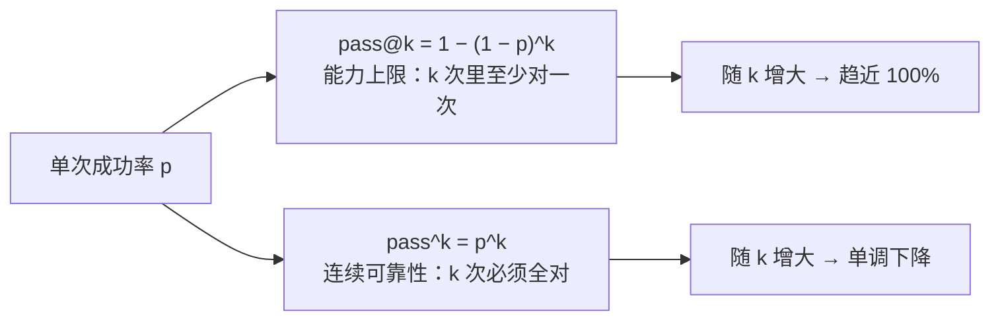
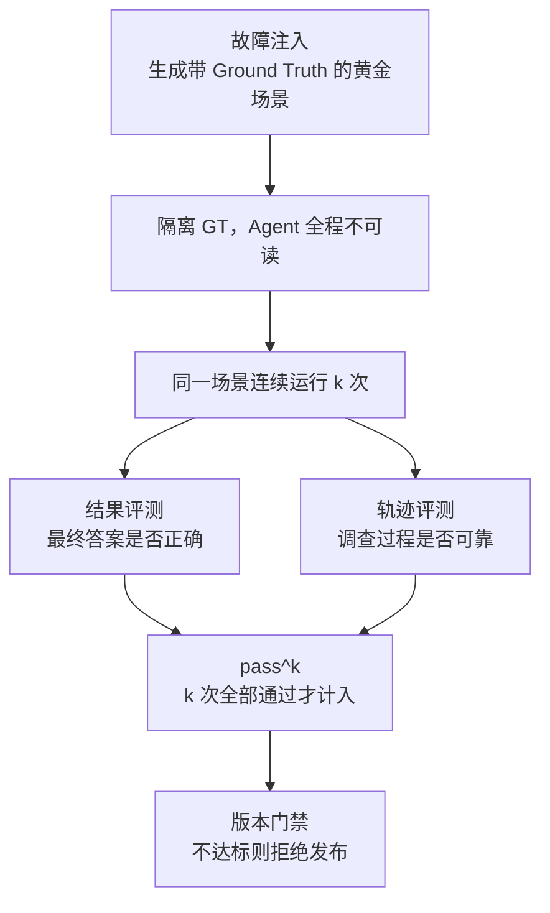

模型评测里最常见的指标是 `pass@k`：跑 k 次，至少成功一次就算过。

这个指标在探索性场景里没问题，但一旦系统要上线，它会系统性地高估可靠性——因为**「至少成功一次」和「每次都成功」在生产里是两回事**。这篇拆一下这个差异，以及围绕它需要配哪些东西。

## 一个反直觉的算术

假设单次成功率是 `p`，独立重复 k 次：

- `pass@k = 1 − (1 − p)^k` —— 至少一次成功
- `pass^k = p^k` —— 每次都要成功

取 `p = 0.9`：

| k | pass@k | pass^k |
| --- | ---: | ---: |
| 1 | 90% | 90% |
| 3 | 99.9% | 72.9% |
| 5 | 99.999% | 59.0% |

同一个系统，`pass@3` 读作 99.9%，`pass^3` 读作 72.9%。**两个数字描述的是同一个东西，差距来自口径。**

`p` 越低，剪刀差越大。取 `p = 0.7`：`pass@3` 是 97.3%，`pass^3` 只有 34.3%。

注意两条曲线的方向是**反的**：k 越大，`pass@k` 越好看，`pass^k` 越难看。所以「我们跑了 5 次至少有 1 次对」和「我们跑了 5 次 5 次都对」在工程上是完全不同的两句话。

> 补充一个精度问题：上面的公式假设各次独立同分布。实践中 `pass@k` 通常用 Codex 论文里的无偏估计 `1 − C(n − c, k) / C(n, k)`（n 次采样中 c 次正确），避免小样本下的偏差。`pass^k` 的估计简单得多——就是 c = n。

## 哪些场景必须看 pass^k

判断标准不是「技术先进」，而是**失败能不能被用户重试掉**。

- 代码补全、头脑风暴、搜索建议：用户可以点「重新生成」。失败一次的成本接近于零，`pass@k` 是合适的口径。
- 支付诊断、资金结算、发布门禁、自动化处置：失败一次就是一次事故。用户不会接受「多试几次总有一次能诊断对」。

我在做支付转化异常归因时把这条设成了硬门禁：同一场景连续运行 k 次必须全部通过，才认为这个版本是可靠的。理由很直接——**一个偶尔成功的诊断系统，和一个稳定的诊断系统，在生产上不是同一个产品。**

## 光有指标不够：三个配套件

指标本身只是分母和分子。要让 `pass^k` 这个数字可信，还得配三样东西。

### 1. Ground Truth 隔离

这是最容易被忽略、也最致命的一条。

如果被测的 Agent、它的工具或者它的 Prompt 有机会读到标准答案，那么评测出来的高分说明不了任何问题——**虚假的高分比低分更危险**，因为低分会让你去修，高分只会让你放心发布。

所以隔离必须是结构性的，不能靠自觉：

- 隐藏集只由评测侧维护，运行时进程**物理上**读不到；
- 评测器主动检查泄漏（而不是假设不会发生），把「GT 泄漏」做成一个和准确率同等重要的指标；
- 隐藏集与开发集的场景**错开构造**，防止针对考纲训练。

### 2. 故障注入与带标签的黄金场景

真实生产里，「失败」往往是稀疏且没有被完整记录过的。只等线上出问题来攒评测集，永远攒不够。

可配置的故障注入解决这个问题：主动构造已知根因的异常（渠道超时、状态机错乱、配置发布与优惠变更叠加……），每个场景自带 Ground Truth，于是评测可以稳定复现、自动判分、版本回归。

代价要说清楚：**注入的分布由人设计，覆盖不到尚未被记录过的失败形态。** 这是模拟评测的固有边界，不是实现瑕疵。

### 3. 结果评测 + 轨迹评测，两条轨

只评最终答案会漏掉一半问题。一个 Agent 可能碰巧给出了正确答案，但过程是错的——绕了 20 步、查了不该查的数据、工具失败后没有正确降级。

所以两条轨分开评：

| 轨道 | 回答的问题 | 典型指标 |
| --- | --- | --- |
| 结果评测 | 最终答案对不对 | 准确率、F1、误差 |
| 轨迹评测 | 过程可不可靠 | 工具选择是否匹配范围、有无无效调用与循环、失败后是否正确降级、是否及时停止 |

这两条轨经常给出相反的信号——**结果对但过程错，恰恰是最危险的组合**，因为它说明系统不稳定，只是这次运气好。而这正是 `pass^k` 要暴露的东西。

## 一个容易踩的坑：预算会成为评测量纲

这是我自己撞过的墙，值得单独说。

我用真实模型跑第一轮评测时，发现策略 Agent 的发现率异常低。查 Trace 才明白：90 秒的时间预算**结构性截断**了 Agent——它平均 75.8 秒、13.75 步就被掐断，从未走到提交候选那一步。而 Random / BFS 这类确定性基线不受时间预算影响，于是这场对比从一开始就不公平。

修正方式是**只改一个变量**：把 `max_time_seconds` 从 90 调到 300（依据实测 p95 延迟校准），Case 内容、期望答案、其他预算和门禁阈值全部不动，并声明旧结果不可复用于新口径。

这里的方法论比数字重要：

1. **先测量，再改**——不要凭感觉调参；
2. **一次只改一个变量**——否则无法归因；
3. **旧结论作废**——口径变了，历史数字就不能再引用。

如果当时图省事顺手把 Prompt 也改了，那这轮评测就白跑了——你永远不会知道是预算还是 Prompt 起了作用。

## 关于「诚实降级」

最后一条是我认为最值得坚持的：

**门禁不能因为没有好消息就变绿。**

如果评测口径是「发现率 ≥ 75% 才放行」，而实测只有 0–20%，那么正确的输出就是**拒绝发布**，并且在文档里如实写「搜索层尚未达标」。把口径悄悄改成「发现机制可信」然后宣布通过，比指标难看危险得多。

指标难看只是丢面子；门禁会为好消息让路，那它就不再是门禁了。

## 小结

- `pass@k` 测能力上限，`pass^k` 测连续可靠性，k 越大两者差距越大，方向相反；
- 失败可重试的场景看 `pass@k`，失败即事故的场景必须看 `pass^k`；
- 指标可信的前提是 GT 隔离、故障注入、双轨评测三件套；
- 预算/步数这类资源约束会悄悄成为评测量纲，要一次只改一个变量；
- 口径改变了，旧结论必须作废——**拒绝发布也是评测系统的正常输出**。
