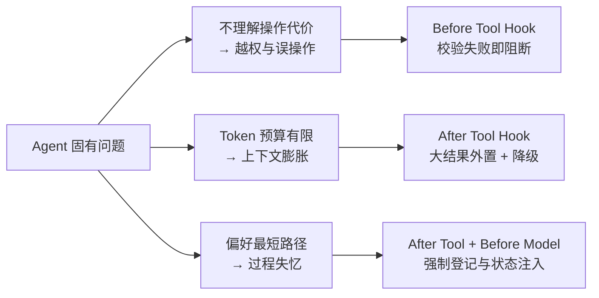

在 Prompt 里写「不要删除生产数据」，和在代码里拒绝删除生产数据，是两种完全不同的保证。

前者是**概率**，后者是**确定性**。Agent 系统里大量的问题，根源都是把本该由代码保证的事情交给了自然语言。

一句话总结我的立场：

> **能由代码确定性保证的事情，不交给模型自行决定。Prompt 适合表达意图，不适合充当安全边界。**

这篇讲这套思路在工具调用层怎么落地——Before / After Tool Hook 链。

## Agent 的三类固有问题

先把问题说清楚，因为 Hook 链的每个切面都是在回答其中一个。

### 1. 模型不理解操作的真实代价

对模型来说，`query_usage`（查询用量）和 `publish_settlement`（发布结算）只是两个不同的字符串。它没有「这个操作一旦执行，几百户的账单就定了」这种感知。

这不是模型的缺陷，是它的本质——它预测的是 token，不是后果。所以**让模型自己判断「这个操作危不危险」，等于让它做一件它结构上就做不好的事。**

### 2. Token 预算是物理约束

一次查询返回几万行明细是常态。全塞进上下文，结果是两件事同时发生：真正需要推理的信息被挤出去了，成本还涨了。

### 3. 模型偏好最短路径

额外的校验、确认、记录中间状态，在模型看来都是「多出来的步骤」。它会倾向于跳过——不是不听话，而是最短路径在训练分布里天然得分更高。



## Hook 链的三个切面

### Before Tool：执行前，失败即阻断

职责是在副作用发生之前把不该发生的挡掉：

- 参数 Schema 校验（类型、范围、必填）
- 业务前置条件（对象是否存在、时间范围是否合理、数据是否完整）
- 权限与作用域（这次调用是否在这个任务被授权的范围内）
- 高风险操作的人工确认状态

关键词是**阻断**。校验不通过就不执行，没有「尽力而为」的中间态。

### After Tool：执行后，失败则降级

职责是登记事实、控制上下文、更新任务状态：

- 登记证据（调用 ID、查询指纹、结果哈希），让后续结论可以回溯到具体一次调用
- 大结果外置为 Artifact，上下文里只留摘要和引用
- 记录副作用（这次调用改变了什么）
- 更新任务状态／假设台账

这里的关键词是**降级**。外置失败不应该让整条链路挂掉——退回透传原文，功能弱一点但继续可用。

### Before Model：下一轮调用前，注入状态

这一层最容易被忽略，但它解决的是「过程失忆」：

- 把上一次工具调用的副作用注入下一轮（刚刚那次操作改变了什么）
- 注入当前预算消耗
- 注入尚未解决的问题，避免模型重复走已经排除的路径

没有这一层，模型每一步都在「从零开始想」，于是反复查同样的东西、反复验证已经确认过的事实。

## 核心设计原则：失败语义必须匹配操作代价

这是我认为整套设计里最值得抄的一条。

| 方向 | 失败时应该做什么 | 为什么 |
| --- | --- | --- |
| 读（查询、检索） | **降级**——退回透传原文 | 读错了代价可控，让流程继续比中断更有价值 |
| 写（发布、扣减、配置变更） | **阻断**——拒绝执行 | 写错了不可撤销，宁可这次任务失败 |

很多 Agent 框架的默认行为是「工具失败就重试」或者「工具失败就让模型想办法」。这两者在写操作上都是错的——**写操作失败后的正确动作是停下来，而不是再试一次。**

## 风险分级不是独立机制，是 Hook 链的参数

常见的做法是给工具打风险标签，然后按标签走不同流程。听起来像两套机制，其实是一套：**风险等级只是 Hook 链的参数配置。**

```text
R0（只读查询）    → After Tool 登记结果即可，Before Tool 不做阻断
R1（草稿、备注）  → Before Tool 校验预览，失败阻断
R2（启停、归属、结算发布）
                  → Before Tool 校验：二次确认 + 影响说明 + 幂等键 + 审计，任一失败即阻断
```

这样设计的好处是：新增一个工具时，你只需要回答「它是几级」，而不是「它要走哪条特殊流程」。**分级把组合爆炸压成了单选。**

## 为什么这件事不能交给 Prompt

一个自然的反驳是：把上面这些规则写进 System Prompt 不就行了？

三个理由说明为什么不行：

1. **Prompt 的生效是概率性的。** 同一条指令在长上下文里会被稀释；上下文越长，越靠后的约束越容易被忽略。安全边界不能有「大部分时候生效」这个状态。
2. **Prompt 无法感知真实状态。** 它不知道这次调用传进来的 `tenant_id` 是不是当前用户所属的租户，也不知道这个对象在数据库里是否真的存在。校验需要读真实状态，Prompt 读不到。
3. **Prompt 会被推理绕过。** 只要边界写在自然语言里，它就只是输入的一部分，可以被后续输入覆盖、重述、重新解释。写在代码里的边界不会。

反过来说，Prompt 擅长的是**意图表达**：这次任务的目标是什么、什么算完成、输出希望是什么形态。这部分本来就不该硬编码。

**两者分工，而不是二选一。**

## 边界与反对意见

这套东西不是没有代价，说清楚它什么时候不适用：

- **Hook 链是有成本的。** 每个工具都要定义 Schema、风险等级、幂等键、审计字段，新增写工具的成本远高于加一句 Prompt。工具少、全是只读的场景，上这套是过度设计。
- **它会降低灵活性。** R2 级操作要求逐次人工确认，批量或高频场景下的确认体验目前没有好答案。这是真实的取舍，不是可以轻易抹平的。
- **它不解决模型能力问题。** Hook 链保证的是「不会发生不该发生的事」，不是「一定能做成想做的事」。两者都要，但别指望前者顺带解决后者。
- **幂等键的设计比 Hook 本身更难。** 重试时如果换了幂等键，约束就永远不会生效——这是 Hook 链最常见的一个静默失效点。

## 小结

- 模型预测 token，不预测后果——所以「危险判断」不该由它做；
- Before Tool 阻断、After Tool 降级、Before Model 注入状态，三个切面各解决一类固有问题；
- **失败语义要匹配操作代价**：读降级、写阻断；
- 风险分级是 Hook 链的参数，不是第二套机制——它把组合爆炸压成单选；
- Prompt 负责意图，代码负责边界，这是分工不是替代；
- 这套设计有成本，工具全是只读、调用量很低的场景不值得上。
